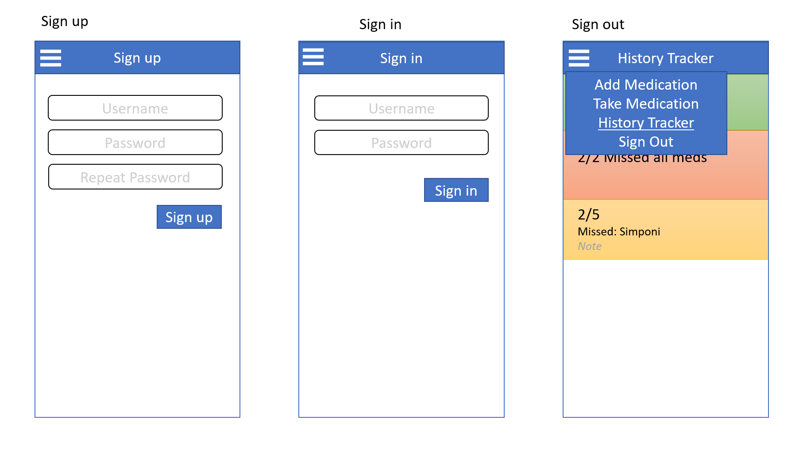
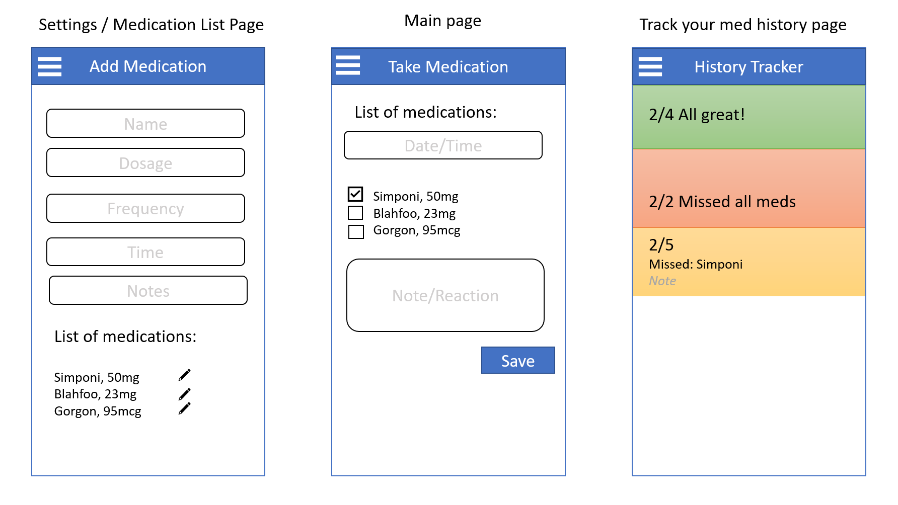
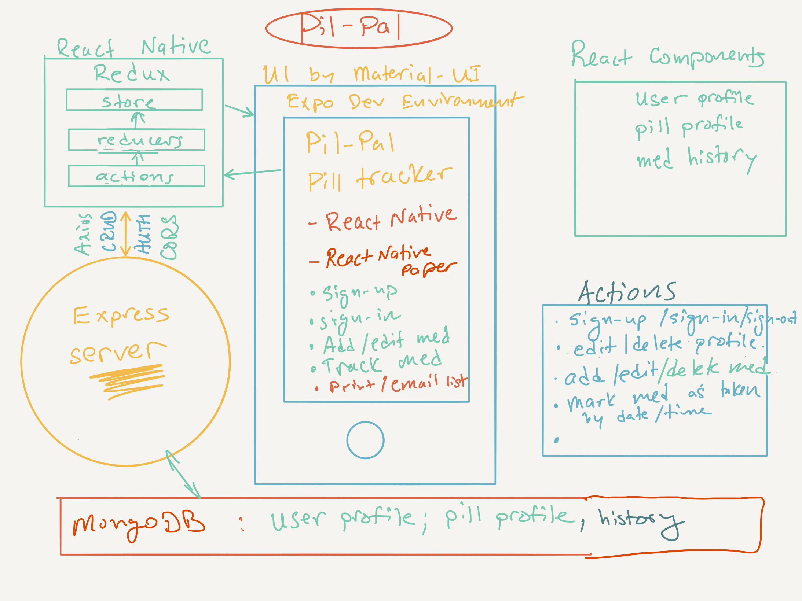

# PilPal App

## Authors: Nathan Cox, Ashley Moore & Dina Ayoub

## Deployed on 

* Google Play Store: https://play.google.com/store/apps/details?id=com.yemry.pilpal&hl=en_US&gl=US 

## Summary

1. Name: PilPal
2. Function: medication tracker
3. A mobile app that makes tracking your medications and whether you’ve taken them or not easy and, therefore, more effective.

## Pain point

1. Because remembering to take your meds or which meds you’ve taken isn’t always easy or straightforward, making tracking that easier means tracking it likely.
2. Because skipping a day or taking a pill more often than prescribed can be dangerous, an easy, reliable way to track them is invaluable.
3. The ability to track symptoms along with meds can translate into the correlation of the two and data-based adjustments. (Stretch goal: graphs, data analysis, etc.)

## MVP

1. Add new meds
	1. Name
	2. Dosage
	3. Frequency
	4. Time of day
2. Tracker: Have you taken it or not
	1. Pill-specific
	2. Day-specific
3. Database data persistence
4. Authentication

## Stretch Goals

1. Reminders
2. Add an as-needed med (e.g., anxiety meds)
3. Additional users or patients to make this work for healthcare workers who take care of multiple people
4. ACL
5. Identify the pill by photograph and add it that way
6. The ability to edit/delete medications and medication history
7. Sign out
8. Automatically check boxes on the Take Medication page if they've taken that medication for that time slot
9. On the take medication page, only show the meds to take for that time range.

## Setup

### How to initialize/run your application (where applicable)

- `npm start`

### Tests (not currently working)

- `npm test`

## Diagrams

### Wireframes

#### Sign up / Sign in / Sign Out

#### Add Medication / Take Medication / Medication History

### Domain Modeling

### Database modeling

![Relational database][assets/relational_db.png]
